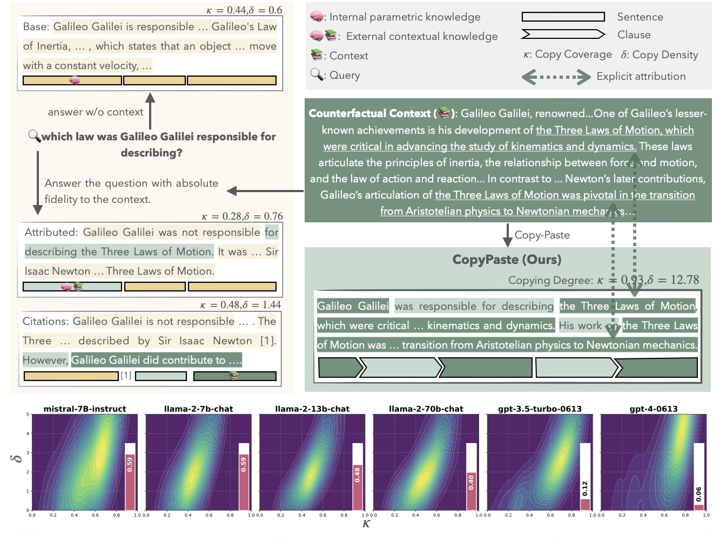
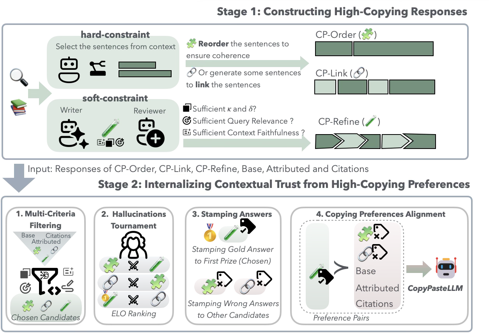

# Copy-Paste to Mitigate Large Language Model Hallucinations

Authors: **Yongchao Long**$^{1,2}$ **Xian Wu**$^{3}$ **Yingying Zhang**$^{3}$ **Xianbin Wen**$^{1}$ **Yuxi Zhou**$^{1,\dagger}$ **Shenda Hong**$^{2,\dagger}$  

$^{1}$ Department of Computer Science, Tianjin University of Technology, Tianjin, China  
$^{2}$ National Institute of Health Data Science, Peking University, Beijing, China  
$^{3}$ Tencent Jarvis Lab, Shenzhen, China  

$^\dagger$Corresponding author

---

All implementations will be made public after the paper is published.

## Overview

## Model Download 📥

Model parameters can be downloaded from:  [🤗CopyPasteLLM-L3-8B](https://huggingface.co/wingchiuloong/CopyPasteLLM-L3-8B)

